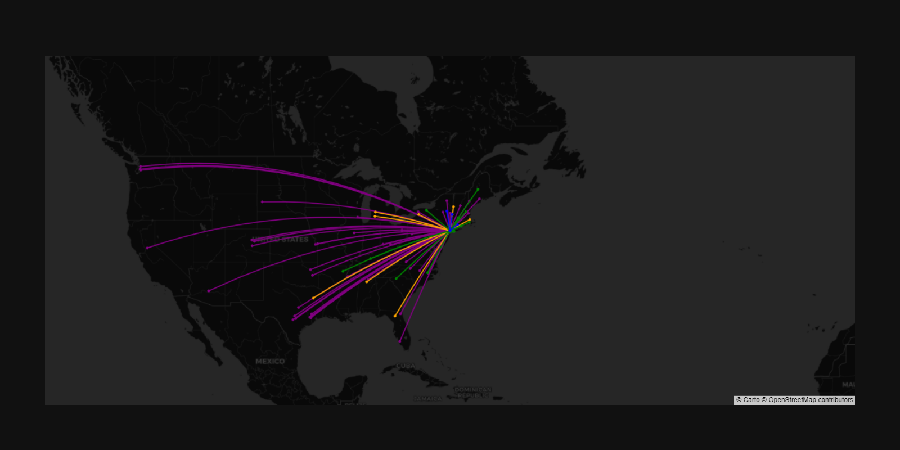

A collection of tools for amateur radio by [KC0AGR](https://www.qrz.com/db/kc0agr), including [standing wave ratio](https://github.com/agr78/kc0agr/blob/main/nanovna/vswr.ipynb) and [power calculations](rf_exposure/rf_pd_calc.ipynb) used for station evaluations, [GPS data processing](gps), various [configuration files](config), and [QSO maps](maps) like the one below.

